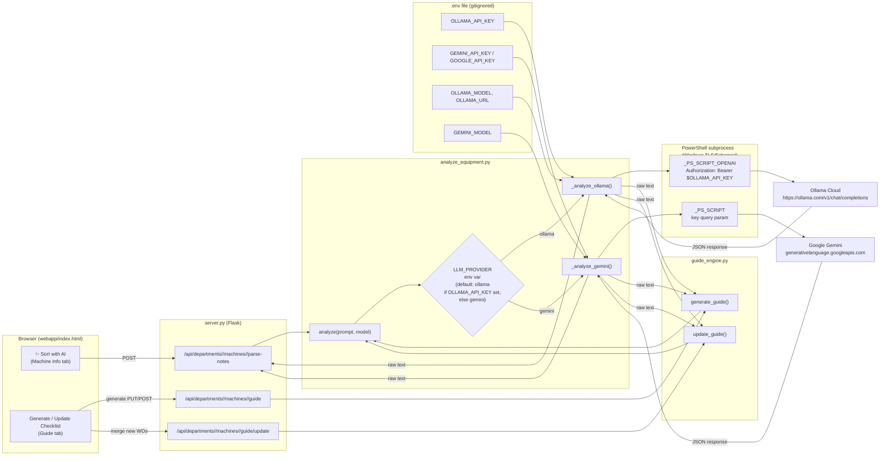

# API Key Flow — MINT

This shows how the `.env` API keys reach the actual AI providers, and which
features in the app trigger each call.

## Key points

- **Single choke point**: every AI call in the app funnels through
  `analyze_equipment.py`'s `analyze(prompt, model)`. Nothing else touches the
  network directly.
- **Provider selection**: `LLM_PROVIDER` env var picks the provider. If unset,
  it defaults to `"ollama"` **only if `OLLAMA_API_KEY` is present**, otherwise
  falls back to `"gemini"` (`analyze_equipment.py:394-397`).
- **Key never touches the browser**: the API key lives only in the `.env`
  file on the server machine, read via `os.environ.get(...)` in
  `analyze_equipment.py`. The frontend never sees it — it only calls MINT's
  own `/api/...` routes, which are gated by the shared **edit password**
  (`EDIT_PASSWORD`), not the AI provider key.
- **Why PowerShell?** Corporate network resets OpenSSL/Python TLS, so both
  providers are called via a temporary PowerShell script using Windows'
  native Schannel TLS stack (`_PS_SCRIPT_OPENAI` for Ollama's
  OpenAI-compatible endpoint, `_PS_SCRIPT` for Gemini).
- **Two entry points into the LLM**:
  - `/api/.../parse-notes` (server.py) — "Sort with AI" button, sorts messy
    PM notes into contacts/logins/cost/notes.
  - `guide_engine.py`'s `generate_guide()` / `update_guide()` — builds or
    merges machine checklists from unscheduled work orders.
